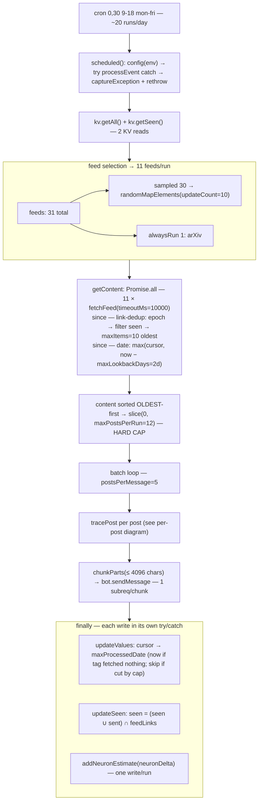
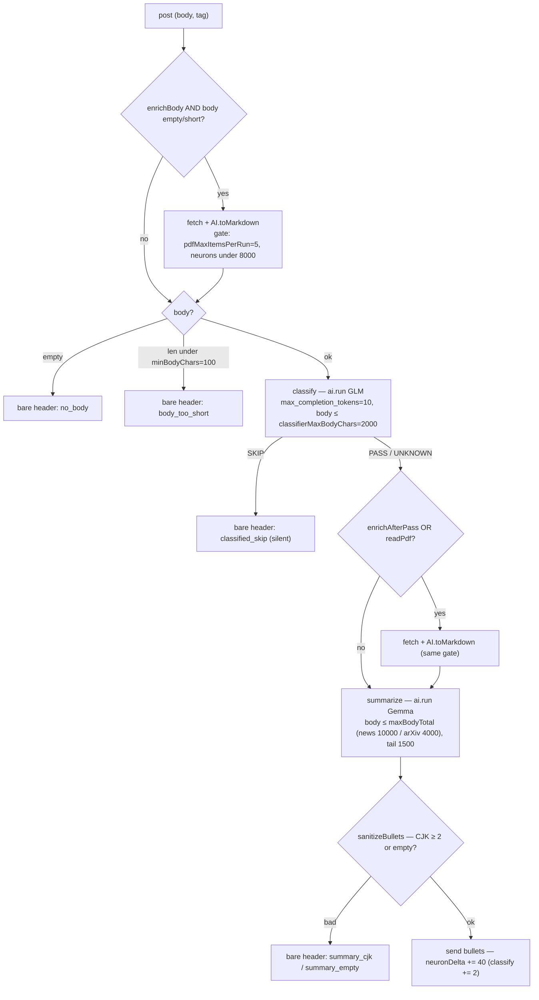

# rssdoge

Cloudflare Worker: on a cron schedule fetches RSS feeds, summarizes posts via Workers AI, sends to Telegram.

## Documentation language

| Location | Language |
|----------|----------|
| `CLAUDE.md`, `README.md`, `.claude/skills/**` | **English** |
| `plans/**` (local, gitignored) | **Russian** |

Technical identifiers (`KV`, `bare header`, `captureException`) stay as-is in any language.

**Chat replies:** answer the user in the language they wrote in (Russian → Russian, English → English). This is separate from the file-language table above, which governs written artifacts, not the conversation.

## Code comments

Keep comments minimal: only what a human can't easily infer from the code itself (a non-obvious invariant, a gotcha, why-not-the-obvious-thing). Do **not** narrate what the code does or restate design rationale in the source. Rationale, trade-offs, and "why" belong in this file (`CLAUDE.md`) — reference it from a one-line comment (`// … see CLAUDE.md`) instead of duplicating it inline.

**Comments are written in English** — always, regardless of the chat language. Russian belongs only in prompt strings (`AI_PROMPT`, `CLASSIFIER_PROMPT`, … in `src/config.ts`) and test fixtures, where it's content the model consumes, not a comment.

## Local agent-loop artifacts (`plans/`)

Session drafts — feature plans, backlog, "what's left" notes — **only in `plans/`**, not in the repo root. The directory is in `.gitignore`; do not commit it.

**Where to put things**

| Type | Path | Example |
|------|------|---------|
| Implementation plan | `plans/<topic>-plan.md` | `plans/whitepapers-plan.md` |
| Backlog / open session questions | `plans/issues.md` | ad-hoc, one file or by topic |
| Done | `plans/done/` or delete | archive or simply delete |

**Plan status** — YAML frontmatter at the top of the file:

```yaml
---
status: active   # active | done | cancelled
created: 2026-07-07
---
```

`done` → move to `plans/done/` or delete. Stable conclusions from a plan go here (CLAUDE.md), into `.claude/skills/`, into code, or README — don't leave them only in `plans/`.

**Agents:** do not create `*-plan.md`, `issues.md`, or drafts in the repo root; new local markdown only under `plans/`.

## Invocation flow (cron → Telegram)

How the pieces get called and where each limit/constant bites. Exact values live in **Quotas and limits** and `AppConfig` (`src/config.ts`); the diagrams annotate where they apply.

**Run level** — one cron invocation:



**Per post** — inside `tracePost` (`src/pipeline.ts`); prompt pair + body limits are picked per feed:



## Non-obvious behavior

### `src/config.ts`: only four fields differ between prod and dev

`config(env)` spreads one `shared` object into both environments and overrides only `authentication`, `baseURL`, `telegramChatID`, and `feeds`. Prompts and feed maps are module-level consts (`AI_PROMPT`, `CLASSIFIER_PROMPT`, `FEEDS_PRODUCTION`, `FEEDS_DEVELOPMENT`). Add a shared setting once in `shared` — there is no prod/dev duplication left to sync by hand.

### Workers AI: response shape depends on the model

OpenAI-style models (e.g. `@cf/zai-org/glm-4.7-flash`) return `result.choices[0].message.content`. Llama-style models return a flat `result.response`. The `extractContent()` helper in `src/ai.ts` intentionally handles both. When switching models, verify what the model actually returns and extend the chain if needed — don't replace it blindly.

### Two-step LLM pipeline: classify → summarize

For each post with a non-empty `body`, `tracePost()` (`src/pipeline.ts`) runs `classifyPostDetailed()` first (`max_completion_tokens: 10`, one token `PASS`/`SKIP`), then — only if not `SKIP` — `summarizePostDetailed()`. Both take an options object (`{ ai, model, prompt, ... }`). **Two models, split by stage** (`config.ts`): `classifierModel` = GLM (`@cf/zai-org/glm-4.7-flash` — CJK is irrelevant for a one-token `PASS`/`SKIP`), `summaryModel` = Gemma (`@cf/google/gemma-4-26b-a4b-it`). The debug endpoint can override either per-run (`?model=` for summary, `?classifierModel=`) for A/B testing. **Prompt pair is chosen per feed** via `resolvePrompts(config, tag)`: `prompts: "whitepaper"` (only arXiv today) gets `whitepaperClassifierPrompt` / `whitepaperPrompt`; `prompts: "essay"` (Schneier + Venables) gets `essayClassifierPrompt` / `essayPrompt`; the default (`prompts: "news"`) gets `classifierPrompt` / `aiPrompt`. More reliable than one hybrid prompt: a small focused classifier task vs. a large multi-task summary. **The "essay" pair** exists because the news classifier `PASS`es only technical content (vulns/attacks/tools/incidents), so opinion/analysis columns (AI, privacy, security policy, leadership) were all `SKIP`'d → bare headers. `essayClassifierPrompt` instead `PASS`es any post carrying an author's argument/idea (still `SKIP`s marketing/product/vacancy/award); `essayPrompt` keeps brevity but summarizes the thesis and key ideas rather than hunting technical know-how (there is none in these).

The classifier returns `PASS` / `SKIP` / `UNKNOWN`. On `UNKNOWN` — fall through to summary (don't drop the post) + warning in Glitchtip. `SKIP` is sent silently as a bare header (by design; add logging behind a flag if you want visibility into false-positive skips).

Safety net: if the summary model still outputs `__SKIP_BULLETS__` (the prompt no longer mentions it), `tracePost()` (`src/pipeline.ts`) catches it and turns it into a bare header.

### Empty bullets are a feature — five causes

A post goes to Telegram as a bare header (`createPostMarkdown(post, "")`) in five cases:
1. `!post.body` — feed didn't return a body;
2. `post.body.length < minBodyChars` — body too short (e.g. reddit `[removed]` with template `[link] [comments]` ≈ 17 chars). Filtered **before** LLM calls so the model doesn't hallucinate content from the title alone;
3. `classification === "SKIP"` — classifier filtered it out;
4. `sanitizeBullets` rejected the output (CJK ≥2 chars or empty after normalization);
5. `bullets.trim() === "__SKIP_BULLETS__"` (legacy safety net).

Each case is logged via `logBareHeader()`: always `console.log('[bare-header] <reason>...')` (visible in `wrangler tail`), plus — for all except `classified_skip` — `captureException` with tag `reason` (groups in Glitchtip under a single issue "Post ended as bare header"). `classified_skip` is intentionally silent — too much filtered marketing would clutter the dashboard.

Do not add `continue` / skip logic: every post must reach the channel at least as a title with a link.

### Summary output sanitizer (`src/ai.ts`)

After `ai.run`, the result goes through `sanitizeBullets()`:
- `hasTooManyCJK` — if the text has ≥2 CJK characters (Chinese/Japanese/Korean), bullets are dropped entirely. Threshold `>=2` because the model hallucinates CJK in pairs (`全球`, `攻击`); a single character might be legitimate (author name, etc.).
- `stripMarkdown` — removes backticks, `**bold**`, `*italic*`, `## headings`, code fences. Reason: `parse_mode: html` in Telegram; markdown renders as literals.
- `normalizeBullets` — adds `- ` prefix to each non-empty line if the model forgot the format.

On rejection (CJK), `SummaryResult.rejectedReason = "cjk"` — this tag goes to Glitchtip as a warning to track frequency.

**Why Gemma for summary.** CJK bleed into the Russian output is a trait of Chinese-origin models; GLM (Zhipu) did it (~3 rejects / 2 days in prod). An A/B via the debug endpoint (`?model=`) over `opennet` (Russian source) + `arxiv_cscr` (English) showed `@cf/google/gemma-4-26b-a4b-it` at **0 CJK across 22 posts** with clean Russian and cheaper output neurons, so `summaryModel` moved to it. `mistral-small-3.1-24b` and `qwen3-30b-a3b-fp8` were rejected: both return **empty content** with the current `ai.run` params / `extractContent` (Mistral: response shape; Qwen3: reasoning eats the completion) — they'd need integration work before being viable. The sanitizer stays regardless — model-agnostic insurance that now simply idles.

### Mixed-script detector (`mixedScriptTokens`) — log-only

Separate from CJK: catches a stray Latin letter inside an otherwise-Cyrillic word (e.g. Gemma once wrote `состtированные`) — a token-level model glitch the CJK check can't see. Signal = one pure-letter run (`\p{L}+`, so apostrophes/hyphens/digits are separators) that mixes both scripts. Legit domain mixing is always split by those separators (`patch'а`, `MCP-сервер`, `IPv6`, `Log4j`), so it doesn't trip. `summarizePostDetailed` runs it on the final `bullets` and returns `mixedScript?: string[]`; `logMixedScript()` (`src/index.ts`) reports it to Glitchtip under tag `reason:mixed_script`.

**Deliberately log-only — never drops or alters the summary.** Stripping the stray char can't recover the real word, and dropping a whole readable summary for one cosmetic glitch is too harsh. Purpose now is to **measure frequency** (`bytag reason` → `mixed_script`); escalate to a one-shot summarize-retry only if it proves common.

### KV cursor (date) vs link-dedup — chosen by the `dedup` flag

Two dedup mechanisms, selected per feed by the entry's `dedup` field (`"date"` default, `"link"` opt-in). Membership in a separate map is no longer what decides it — read the flag via `feedFor(config, tag)?.dedup`.

**`dedup: "date"` feeds — date cursor.** `ctx.kv.updateValues(...)` in `finally` (`src/index.ts`) receives a **per-tag** `Record<string, Date>`. `buildCursorUpdates()` advances the cursor to **the newest post actually processed for that tag** — *not* `now` — because a run processes only the first `maxPostsPerRun` posts (oldest-first); anything cut by that cap must be re-fetched next run, not skipped. A tag that **fetched nothing** is caught up → `now`; a tag whose posts were **all cut by the cap** is left untouched (retry next run). Link-dedup tags are skipped. Only tags **not in `failedTags`** are updated. A tag is added to `failedTags` on (a) `fetchFeed` failure, (b) `bot.sendMessage` failure on a chunk that included a post from that tag.

**Lookback floor + per-run cap (why the cursor advance is conservative).** Two guards, both in `src/index.ts`, added after a prod incident where the cursor froze (`age` stuck for days) and every run resent the same posts — see **Quotas** below for the mechanism. (1) `getContent` clamps `since = max(cursor, now − maxLookbackDays)`, so a stale cursor can't make a run fetch an unbounded backlog. (2) after merging+sorting all feeds **oldest-first**, `processEvent` slices to `maxPostsPerRun` before the LLM loop, bounding subrequests so the run finishes and the `finally` KV writes land. Together they make a frozen cursor **self-healing**: each bounded run drains forward and persists progress. `maxLookbackDays` (2) means backlog older than that on recovery is skipped, not sent — acceptable (it's stale).

**`dedup: "link"` feeds — link-dedup (KV `seen`), NOT a date cursor.** Only arXiv today. arXiv gives every entry the same daily `pubDate` (verified) and re-announces old papers (v2/v3, cross-list) with today's date, so a date cursor can neither dedup re-announcements nor keep the same-date backlog. Instead `KV.updateSeen(sent, feedLinks)` stores, per link-dedup tag, the set of already-sent **links**, pruned to **what is currently in the feed**: `seen[tag] = uniq((seen ∪ sent) ∩ feedLinks)`. Retention needs no TTL/cap magic number — a link that dropped out of the feed can't be re-fetched, so it's forgotten; the set self-bounds to feed size. `getContent` filters posts with `link ∈ seen[tag]` before the feed's `maxItems` cap (oldest-first, via `limitPosts`). Link-dedup tags therefore always fetch with `since = epoch` (no `ages[tag]` entry). Failure-mode: a link that left the feed and later reappears (weeks-later update) is re-sent once — treated as a legitimately-resurfaced new version.

Trade-off (both mechanisms): if one post from a tag fails but another from the same tag succeeds — the cursor / `seen` won't advance for that tag and the succeeded post is resent next run (duplicate). Deliberate: priority is not losing posts; a duplicate is acceptable.

### Telegram 4096 chars — `chunkParts` in `src/utils.ts`

`sendMessage` limit = 4096 UTF-16 code units. `postsPerMessage: 5` alone doesn't help: 5 posts with bold bullets exceed the limit and TG returns 400. `chunkParts()` splits a batch into sub-chunks ≤`TELEGRAM_MAX_MESSAGE`; if a single post is longer — truncates at the last `\n` with `…` suffix.

On send failure, the **chunk** fails, not the whole batch: only tags of posts in that chunk go into `failedTags`; other posts from the same batch may already have been sent by other chunks.

### Workers AI free tier — 10k neurons/day

Shared budget across models. Rough estimate at current cron schedule (`0,30 9-18 mon-fri`, ~20 runs): blog path ~2400 n/day (4× headroom); arXiv (the one `alwaysRun` feed, `maxItems` 10) runs **every** invocation — classify is negligible (`max_completion_tokens: 10`), summarize is the cost (~40 n each) but bounded by the daily new-post count (arXiv ~59/day, most SKIP → maybe ~20–40 summarize/day). Still well under 10k — see **Quotas and limits** below. Recalculate when changing models, `updateCount`, a feed's `maxItems`, or cron. Heavy models may not fit the daily limit at the current cron schedule.

### Reasoning models consume `max_completion_tokens` on thinking

GLM-4.7-flash and similar reasoning models default to `enable_thinking=true`. Budget goes to internal CoT, `choices[0].message.content` comes back empty — post is sent as a bare header with no errors in logs. Thinking isn't needed for bullet summaries: keep `chat_template_kwargs: { enable_thinking: false }` in `src/ai.ts`. When switching models — check the input schema for reasoning flags.

### Errors go to Glitchtip, not Sentry

`initSentry`, `ctx.sentry`, `env.SENTRY_DSN`, `toucan-js` — historical names; the DSN actually points to Glitchtip (Sentry-compatible). Error dashboard is Glitchtip, not sentry.io. When working with the SDK, remember Glitchtip covers only a subset of the Sentry API (performance, profiling, etc. may not work).

### Warning-level events don't reach Glitchtip

`scope.setLevel("warning")` + `scope.captureMessage(...)` in toucan-js/Glitchtip is **silently dropped** — 0 warning events in the dashboard over 90 days, only errors. Either toucan doesn't propagate level from scope to event, or Glitchtip filters them. Workaround: for "non-fatal but important" signals use `scope.captureException(new Error("Post ended as bare header: ..."))` — they arrive reliably, at the cost of appearing as errors in the dashboard. For grouping by cause use tag `reason` — Glitchtip filter `tag:reason:summary_cjk` works.

### One `feeds` map, per-feed flags

There is a **single** feed map, `feeds: Record<string, FeedEntry>` (`src/config.ts`). A bare string entry is a plain news blog with all defaults; an object overrides only what differs. `FeedEntry` / `resolveFeed` / `getFeedConfig` / `feedsAsUrls` live in `src/enrich.ts`; each flag is documented inline on the type. The flags (all optional, defaults in parens): `enrichBody`, `enrichAfterPass`, `readPdf`, `pdfLink` (false); `dedup` ("date"); `prompts` ("news" | "whitepaper" | "essay", default "news"); `category` (none); `alwaysRun` (false); `maxItems` / `maxBodyTotal` (unset → `config.maxBodyTotal`). Read them anywhere via `feedFor(config, tag)` in `src/pipeline.ts`.

**"whitepaper" is now exactly arXiv** — the one feed that sets `prompts: "whitepaper"` + `category: "whitepaper"` + `dedup: "link"` + `alwaysRun` + `maxItems`/`maxBodyTotal`. Nothing else is special-cased by map membership.

The three feeds that override defaults:
- **arXiv cs.CR** — **abstract-only** (`readPdf: false`). The abstract is clean author-written know-how; the full PDF via `toMarkdown` is noisy and made the model return empty summaries (`finish_reason=missing`). `arxivPdfUrl()`/`readPdf` still exist but are unused by default — re-enable only with a fallback for empty output. Link-dedup + always-run + oldest-first `maxItems` 10; `maxBodyTotal` 4000 (vs 10000 news); `#whitepaper` tag; research prompts. **`pdfLink: true`** — the Telegram anchor points at the PDF (`arxivPdfUrl`: abs→`…/pdf/<id>.pdf`), not the abs page. This is a **display-only** transform: `post.link` stays the canonical abs URL used for link-dedup (`seen`/`feedLinks`), so only `displayLink()` (`src/index.ts`) rewrites the href passed to `createPostMarkdown`. See below on preview suppression.

**PDF link + Telegram preview.** `sendMessage` is text-only — it can never attach/download a file, so a PDF href can't turn into an uploaded document. The only side effect is a link-preview card, which Telegram would try to fetch/render for the PDF. So the send loop (`src/index.ts`) sets `link_preview_options: { is_disabled: true }` on any chunk containing a `pdfLink` post (`chunk.posts.some(... pdfLink)`). Chunks batch multiple posts merged across feeds, and preview options are per-message, so a chunk that mixes arXiv with a news post also loses that news post's preview — accepted (cosmetic, previews only ever showed one card per message anyway). Non-`pdfLink`-only chunks keep the default preview behavior.
- **Google Research blog** — regular news feed (news prompts, date cursor, **no** `#whitepaper`). No body in RSS (only a category ~15 chars) → `enrichBody: true` fetches the page before classify. URL uses trailing slash `…/blog/rss/` (avoids a redirect).
- **PortSwigger Research** — regular news feed. RSS teaser ~250 chars → `enrichAfterPass: true` fetches the full page after PASS.
- **Bruce Schneier** (`bruce_schneier`) — `prompts: "essay"`, no enrichment (full body in RSS ~6k chars).
- **Phil Venables** (`philvenables`) — `prompts: "essay"` + `enrichAfterPass: true` (RSS `description` is a ~500-char teaser, like PortSwigger; fetch the full page after PASS).

**Note:** Google/PortSwigger were formerly under a separate `whitepaperFeeds` map only to get enrichment; they are blogs, so they now use the news `CLASSIFIER_PROMPT` + `AI_PROMPT` and carry no `#whitepaper` tag — only enrichment stayed. **Also plain feeds:** **Elastic Security Labs** (marketing/GA-heavy vendor blog). **Rejected earlier:** IACR ePrint (pure theory + fetch issues).

Flow: `fetchFeed()` → `tracePost()`. Enrichment (`src/enrich.ts`): our `fetch(link)` → blob → `env.AI.toMarkdown()` — converter only, not a crawler. Runs before classify (missing body) or after PASS (PDF/full page). Budget: `pdfMaxItemsPerRun` (default 5/run) + KV neuron gate (`neuronGateThreshold` 8000, key `neurons:<UTC-date>`).

Research summary via `whitepaperPrompt` (know-how focus, 2–6 bullets); domain filter `whitepaperClassifierPrompt` (strict on product/GA/tech-preview/marketing). CJK sanitizer uses the **default threshold 2** everywhere — the sanitizer runs on the Russian *output*, not the source abstract, so CJK is always a hallucination.

arXiv (`alwaysRun`) runs **every cron invocation** (`processEvent` splits feeds into sampled vs `alwaysRun`: `randomMapElements(<sampled>, updateCount)` spread with all `alwaysRun` URLs) — the 50-subrequest cap forbids classifying a full day's arXiv in one run, so the daily backlog is drained across the ~20 runs/day within the feed's window.

### Prompt routing + category tag

`feedFor(config, tag)` (`src/pipeline.ts`) resolves the feed entry; `resolvePrompts(config, tag)` returns the whitepaper pair when `.prompts === "whitepaper"`, the essay pair when `.prompts === "essay"`, else the news pair. The `#whitepaper` Telegram tag is driven by the independent `.category` flag (via `postCategory` in `src/index.ts` → `createPostMarkdown(post, bullets, category?)` in `src/utils.ts`, applied on bare headers too). `prompts` and `category` are separate knobs — a feed could take research prompts without the tag, or vice versa.

### Tag-scoped RSS feeds

`feeds` entries are `tag → FeedEntry` (URL string or `{ url, ...flags }`). Topic slices work as separate tags (e.g. `simonwillison.net/tags/security.atom`). Optional helper pattern: `tagFeeds(base, prefix, tags[])` in config. **Cross-feed dedup:** `fetchFeed` dedupes by `link` within one feed only; overlapping tag feeds from the same source may duplicate (same trade-off as resend-on-partial-failure).

### Quotas and limits (Cloudflare free tier)

| Limit | Free | Where it bites |
|-------|------|----------------|
| CPU per cron | 10 ms | XML parse + `stripHtml` on large feeds (arXiv ~50–100 entries) |
| Wall-time per cron | 15 min | Total fetch + AI per run |
| **Subrequests / invocation** | **50** | **Main ceiling** for future PDF stage |
| Workers AI neurons/day | 10 000 | Summarize; classify negligible |

Resets at **00:00 UTC**. Subrequests count: `fetch(feed)`, `fetch(pdf/page)`, `bot.sendMessage`, `ai.run`, `env.AI.toMarkdown()` — **and every KV `get`/`put`** (a KV binding call is a subrequest). The KV ops are why the budget is tighter than the AI-only estimate suggests: a run draining arXiv (`alwaysRun`, `maxItems` 10 → 10× `ai.run`) plus ~`updateCount` feed fetches sits close to 50, so per-post KV writes matter.

**KV neuron counter:** `KV.neuronsKey()` → `neurons:<YYYY-MM-DD>` (UTC). `addNeuronEstimate()` is called **once per cron run** — the delta is accumulated in memory across posts (`neuronDelta`) and flushed in the `finally`, not written per post. Per-post writes cost 2 subrequests each (pushing a busy arXiv run over the 50 cap) and, being uncaught inside the loop, could abort the run before the `seen` write — which is exactly how arXiv posts got resent. `canSpendNeurons()` still gates enrich before `fetch`+`toMarkdown`, but it reads the start-of-run total (in-run accumulation isn't visible until the flush); safe because per-run enrich is separately capped by `pdfMaxItemsPerRun`. Estimate only (~2 classify, ~40 summarize per post), not exact billing.

**Resilient KV writes in `finally`:** the date cursor (`updateValues`), link-dedup `seen` (`updateSeen`), and neuron estimate are each wrapped in their own `try/catch` + `captureException`. They are independent — a throw in one must not skip the others. Previously all three were unguarded and sequential, so a failure in `updateValues` silently prevented `updateSeen`, resending link-dedup feeds (arXiv) indefinitely. `scheduled()` also wraps `processEvent` in a capture (then rethrows): it has no router/Toucan wrapper, so an uncaught throw there (resource limit, KV error) was otherwise invisible in Glitchtip.

**Enrich budget:** `pdfMaxItemsPerRun` (5) caps `fetch`+`toMarkdown` per cron/debug run.

**Per-run post cap `maxPostsPerRun` (12) — the main subrequest guard.** After a frozen-cursor incident this is the ceiling that keeps a run under 50 subrequests. **The incident:** the date cursor (`age`) stopped advancing; because subrequest-cap throws in `ai.run`/`fetch`/`sendMessage` are *caught* (→ bare headers / `failedTags`) the loop still ran to the end, but the `finally` KV writes (`updateValues`, `updateSeen`) are *new* subrequests over the exhausted budget → they threw and nothing persisted. `seen` was never created (arXiv deduped by nothing → same 10 oldest resent every run) and `age` snowballed (stale cursor → bigger backlog → more over-budget → …). Diagnosis was slow because `scheduled()` had no error capture, so it was invisible in Glitchtip. Fixes: (1) `maxPostsPerRun` + lookback floor bound the work so runs finish in budget; (2) neuron counter batched to one write/run; (3) `finally` writes each wrapped in `try/catch`; (4) `scheduled()` wraps `processEvent` in `captureException`. When raising `maxPostsPerRun`, `updateCount`, arXiv `maxItems`, or adding enrich feeds, re-check the 50 budget: ~`updateCount`+alwaysRun fetches + (≤`maxPostsPerRun`)×(classify+summarize[+enrich]) + sends + `finally` KV.

### Debug endpoint — pipeline dry-run

`POST /debug/tag/:tag` (auth = same Bearer / `TELEGRAM_TOKEN` in prod; auth disabled in dev). Runs fetch → classify → summarize, returns JSON with `pipeline.step`, `feed_raw`, `classifier`, `summary`, `would_send`. **Does not send to Telegram, does not advance KV.** Works for any tag in `feeds` (`feedsAsUrls(config.feeds)`). Query: `?since=<ISO>` (cursor override), `?limit=N` (default 3, max 20). Post logic — `tracePost()` in `src/pipeline.ts` (same path as cron). Skill client: `dotenvx run -- node .claude/skills/debug/debug.mjs tag <tag>` — needs `TELEGRAM_TOKEN` in `.env` (same value as the worker secret; CLI doesn't read Cloudflare secrets). Example: `tag arxiv_cscr`.

### Running locally — three loops, fastest first

**`dotenvx` is not on PATH** — it's a local dev-dependency. Every `dotenvx run -- …` in this file and in the skills (`debug`, `glitchtip`) must be invoked as `./node_modules/.bin/dotenvx run -- …` (or `npx dotenvx run -- …`). Bare `dotenvx` fails with exit 127.

1. **Logic only (offline, no Cloudflare):** `npm test` / `npm run check`. Tests are plain `vitest run` — no config file, no workerd, no `@cloudflare/vitest-pool-workers` (not installed). They import `src/*` directly and run in node. This is the main inner loop; most pipeline logic (`sanitizeBullets`, `tracePost`, feed parsing, `chunkParts`) is covered here without booting a worker.
2. **Pipeline via `wrangler dev` (no Telegram, no KV writes):** terminal A `npm run dev` (dotenvx decrypts `.env` → `wrangler dev --port 3000`, `ENVIRONMENT=development` → `development` config branch: `authentication: false`, dev feeds, dev chatID). Terminal B: `RSSDOGE_BASE_URL=http://127.0.0.1:3000 dotenvx run -- node .claude/skills/debug/debug.mjs tag <tag>`. Uses the debug endpoint (above) — dry-run, no send, no cursor move.

**Gotcha — Workers AI has no local emulation.** `wrangler dev` proxies every `ai.run(...)` to the real Cloudflare API, so local dev needs an authenticated wrangler (`wrangler login`, or `CLOUDFLARE_API_TOKEN` + `CLOUDFLARE_ACCOUNT_ID` in env). Without it AI calls fail and posts come back as bare headers with no obvious error — the usual reason "local debug doesn't work". KV, in contrast, runs locally from `.wrangler/` (dev cursors, not prod).

**tsconfig `types`:** keep it at `["@cloudflare/workers-types"]`. Do **not** re-add `@cloudflare/vitest-pool-workers` or `vite/client` — neither is installed, and listing an uninstalled package in `types` makes `tsc` fail. The vitest pool isn't used (see loop 1).

### Deploy runs a gate: typecheck + tests

All of `src/` is TypeScript and `tsc --noEmit` is clean — keep it that way (no CI enforces it; the gate is at deploy time). `npm run deploy` runs `npm run check` (`tsc --noEmit` + `vitest run`) **and** the dry-run `build` before the real `wrangler deploy`; any failure aborts the deploy. Run `npm run check` yourself before finishing a change — a type error or a failing test will block the next manual deploy. Tests are in `tests/` (vitest): `sanitizeBullets`, `tracePost`, feed body extraction, and `chunkParts` / `createPostMarkdown` / `sortDate`.

Functions with many similar-typed params take an options object (`classifyPostDetailed`/`summarizePostDetailed` in `src/ai.ts`, `fetchFeed` in `src/feed.ts`) — pass named fields, not positional args.
