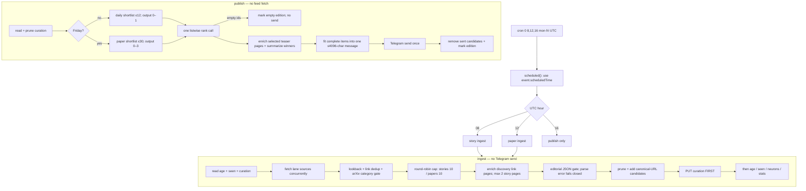
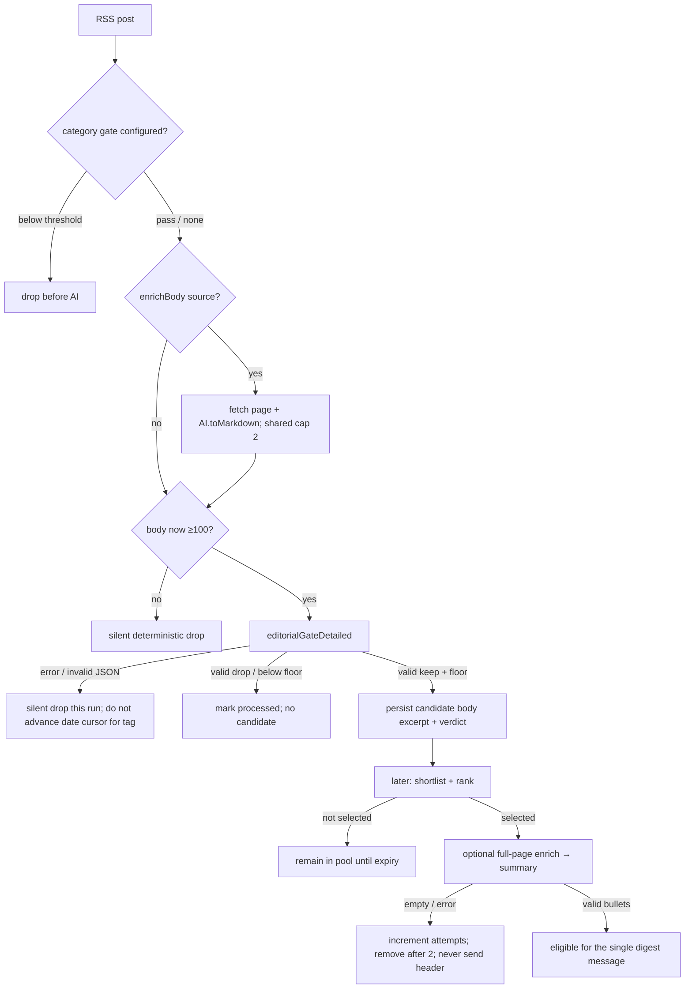

# rssdoge

Cloudflare Worker that turns a small set of security RSS feeds into a deliberately sparse Telegram digest. New items enter a candidate pool, compete in a batch ranking step, and only the winners are summarized and sent.

## Documentation language

| Location | Language |
|----------|----------|
| `CLAUDE.md`, `README.md`, `.claude/skills/**` | **English** |
| `plans/**` (local, gitignored) | **Russian** |

Technical identifiers stay as-is in any language. Chat replies follow the language used by the user.

## Code comments

Keep comments minimal: only non-obvious invariants, gotchas, or reasons not to use the obvious implementation. Put broader rationale here instead of narrating the code. Comments are always in English; Russian is allowed in model prompts and test fixtures because it is content consumed by the model.

## Local agent-loop artifacts (`plans/`)

Session plans and drafts live only under `plans/`, never in the repository root. The directory is gitignored.

Every plan starts with:

```yaml
---
status: active   # active | done | cancelled
created: 2026-07-07
---
```

Move completed plans to `plans/done/` or delete them. Stable conclusions belong here, in code, in README, or in a skill.

## Editorial model

The publication rule is:

```text
deterministic rejects → strict quality gate → candidate pool → listwise ranking
  → summarize winners → at most one Telegram notification
```

Quotas are ceilings, not targets. An empty edition is valid. There is no bare-header fallback and no source is an automatic pass.

Candidate kinds:

- `story`: technical blogs and discovery feeds;
- `paper`: arXiv research, held for the Friday edition;
- `analysis`: Phil Venables only; requires a non-obvious thesis and concrete security consequences, not generic thought leadership.

The gate returns validated JSON with `decision`, four 1–5 scores, `topic`, and `reason`. The parser tolerates prose, markdown, or reasoning tags around exactly one complete JSON object, but malformed, ambiguous, or schema-invalid output is fail-closed. A kept story needs `interest >= 4`, `evidence >= 3`, and either `novelty >= 4` or `practical >= 4`. Papers and analysis have stricter kind-specific floors in `passesQualityFloor()`.

## Invocation flow

Exact limits live in `AppConfig` in `src/config.ts`. Keep both diagrams current whenever the schedule, branches, persistence order, or limits change.

### Run level


```mermaid
flowchart TD
    cron["cron 0 8,12,16 mon-fri UTC"] --> sched["scheduled(): use event.scheduledTime"]
    sched --> slot{"UTC hour"}
    slot -->|08| stories["story ingest"]
    slot -->|12| papers["paper ingest"]
    slot -->|16| publish["publish only"]

    stories --> ingest
    papers --> ingest

    subgraph ingest["ingest — no Telegram send"]
      read["read age + seen + curation"] --> fetch["fetch lane sources concurrently"]
      fetch --> pre["lookback + link dedup + arXiv category gate"]
      pre --> cap["round-robin cap: stories 10 / papers 10"]
      cap --> enrich["enrich discovery link pages; max 2 story pages"]
      enrich --> gate["editorial JSON gate; parse error fails closed"]
      gate --> pool["prune + add canonical-URL candidates"]
      pool --> persist["PUT curation FIRST"]
      persist --> cursors["then age / seen / neurons / stats"]
    end

    subgraph pub["publish — no feed fetch"]
      pstate["read + prune curation"] --> lane{"Friday?"}
      lane -->|no| daily["daily shortlist ≤12; output 0–1"]
      lane -->|yes| weekly["paper shortlist ≤30; output 0–3"]
      daily --> rank["one listwise rank call"]
      weekly --> rank
      rank -->|empty ids| mark["mark empty edition; no send"]
      rank --> winners["enrich selected teaser pages + summarize winners"]
      winners --> one["fit complete items into one ≤4096-char message"]
      one --> send["Telegram send once"]
      send --> commit["remove sent candidates + mark edition"]
    end
```

### Per candidate


```mermaid
flowchart TD
    post["RSS post"] --> cat{"category gate configured?"}
    cat -->|below threshold| drop1["drop before AI"]
    cat -->|pass / none| body{"enrichBody source?"}
    body -->|yes| enrich["fetch page + AI.toMarkdown; shared cap 2"]
    body -->|no| body2
    enrich --> body2{"body now ≥100?"}
    body2 -->|no| drop2["silent deterministic drop"]
    body2 -->|yes| gate["editorialGateDetailed"]
    gate -->|error / invalid JSON| retry["silent drop this run; do not advance date cursor for tag"]
    gate -->|valid drop / below floor| processed["mark processed; no candidate"]
    gate -->|valid keep + floor| candidate["persist candidate body excerpt + verdict"]
    candidate --> rank["later: shortlist + rank"]
    rank -->|not selected| wait["remain in pool until expiry"]
    rank -->|selected| summary["optional full-page enrich → summary"]
    summary -->|empty / error| fail["increment attempts; remove after 2; never send header"]
    summary -->|valid bullets| send["eligible for the single digest message"]
```

## Schedule and cadence

The cron is `0 8,12,16 * * mon-fri` (UTC):

- 08:00: ingest all core/discovery/analysis sources plus three deterministically rotated scouts;
- 12:00: ingest paper sources only;
- 16:00 Monday–Thursday: daily story/analysis edition, 0–1 item initially;
- 16:00 Friday: research edition, 0–3 papers.

The publisher may select nothing. All selected items are packed into one Telegram message; a complete item that does not fit remains in the pool rather than creating a second notification.

Slots are separated by hours because Cloudflare KV limits writes to the same key. Always branch on `event.scheduledTime`, not wall-clock time.

## Source catalog

`FeedEntry` is a string for a normal core story feed or an object for real differences: `kind`, `tier`, enrichment, dedup, body/item limits, PDF display, or the arXiv category gate.

Current groups:

- core technical sources: PortSwigger Research, Elastic Security Labs, Google Online Security, Project Zero, Datadog Security Labs, Doyensec, Trail of Bits, Cloudflare Research;
- analysis: Phil Venables;
- scout: Raesene, Unskilled, Rami McCarthy, Kane Narraway, Oblique Security, Pilot Protocol;
- discovery: HN front page through `hnrss` with a 50-point floor, and Lobsters' security tag;
- paper: arXiv `cs.CR` only.

Discovery is just another low-prior source. HN/Lobsters items must pass the same gate and ranking as fixed feeds. `tl;dr sec` remains a manual scout because one newsletter issue contains many links and ads and is not a normal article item.

### arXiv

arXiv is high-recall, low-precision input, never a direct publishing source. It uses:

- primary-category weights before AI;
- link dedup because daily publication dates and re-announcements make a date cursor unreliable;
- abstract-only gate/ranking/summary (`readPdf` is off);
- PDF display links only;
- a separate 9-day paper pool and Friday listwise ranking.

Reassess its yield after four weeks. If selected papers are rare or already found through blogs/discovery, removing arXiv is better than continually tuning a weak prior. If top-venue coverage is missing, prefer one academic API adapter with venue filters over four conference HTML scrapers.

## Curation state and failure semantics

One `curation` KV value contains versioned candidates, recent publications, cumulative per-source funnel counters, and daily/research edition markers. Retention is 3 days for stories/analysis, 9 days for papers, and 14 days for published IDs/topics. Canonical URLs deduplicate the pool. The status JSON exposes fetched/evaluated/kept/dropped/invalid/published counts so weak scout sources can be removed from evidence rather than intuition.

Ordering is intentional:

1. write the candidate pool;
2. only after that succeeds, advance date cursors and link `seen`;
3. persist neuron estimates and feed stats.

If the curation write fails, the source item is retried. A valid gate drop is marked processed. A gate exception or invalid JSON leaves the date cursor for that tag untouched; this may repeat other items from the same feed, but pool dedup prevents duplicate candidates.

Send failure leaves candidates and the edition marker unchanged. Send success followed by state-write failure can duplicate the edition on retry; this is preferable to silent loss and is captured by the scheduled wrapper.

Summary failures never become bare headers. A selected candidate is removed after two failed summary attempts.

## Date cursor vs link dedup

Normal feeds use the `age` date cursor with a two-day lookback floor. Empty successful feeds advance to the scheduled time. Ingest uses newest-first, round-robin selection: this intentionally favors current material and may skip older overflow once a newer cursor is committed.

arXiv uses `seen[tag] = uniq((seen ∪ processed) ∩ currentFeedLinks)`. Only posts with a valid gate result are marked processed; an invalid gate response is retried. The intersection makes retention self-bounding to the live feed.

## Model boundaries

`src/ai.ts` has three model operations:

- gate: GLM 4.7 Flash, JSON output, up to 300 completion tokens;
- rank: Nemotron 3 120B A12B, one JSON array of known candidate IDs, up to 400 tokens;
- summary: Gemma 4 26B, sanitized Russian bullets.

The models are separate `AppConfig` fields (`gateModel`, `rankModel`, `summaryModel`). Gate is the high-volume cheap filter; rank is the single expensive editorial decision; summary uses the model already proven to produce clean Russian for this corpus.

Reasoning models consume completion budget on hidden thinking. Keep `chat_template_kwargs: { enable_thinking: false }` on these calls. `extractContent()` supports both OpenAI-style `choices[0].message.content` and flat `response` shapes.

The summary sanitizer rejects empty or CJK output, removes markdown, normalizes bullets, and detects mixed Cyrillic/Latin tokens. Mixed-script detection is observational; empty/CJK output is a summary failure.

## Quotas and limits

Important Cloudflare free-tier constraints:

| Limit | Design response |
|-------|-----------------|
| 50 external subrequests/invocation | split story and paper ingest; cap each lane at 10 gate calls |
| 10k Workers AI neurons/day | gate/rank are small; summarize only winners; one counter update/run |
| Telegram 4096 UTF-16 code units | fit at most one complete message; truncate an oversized single item |
| KV same-key write rate | one curation write per slot; slots are four hours apart |

A story ingest is roughly 14 feed fetches + at most 10 gates + at most two `fetch`/`toMarkdown` enrichments + KV bookkeeping, which stays below the 50-subrequest ceiling. Recalculate before adding feeds, raising caps, or adding an enrichment stage.

KV neuron accounting is an estimate, not billing truth. It is batched per run so a per-post read/write loop cannot consume the subrequest budget.

## Errors and observability

Historical identifiers say Sentry (`initSentry`, `sentry`, `SENTRY_DSN`), but the DSN points to Glitchtip. Important non-fatal failures use `captureException`; warning-level messages are not reliably delivered by the current Toucan/Glitchtip combination.

`scheduled()` captures and rethrows uncaught errors so Cloudflare also marks the cron failed. Independent cursor/seen/neuron/stats writes are isolated after the mandatory curation write.

## Status and debug endpoints

`GET /` is public. It shows feed health, neuron estimate, story/paper pool sizes, and last edition keys. `?format=json` returns the same operational data.

`POST /debug/tag/:tag` is authenticated in production and open in development. It fetches recent entries, enriches discovery link pages when configured, runs only the new editorial gate, and returns the verdict plus `would_pool`. It never sends, mutates KV, ranks, or summarizes. Query parameters: `since`, `limit` (1–10), and `model` for a gate-model override.

## Running locally

`dotenvx` is a local dependency, not a global command. Use `./node_modules/.bin/dotenvx` or `npx dotenvx`.

1. Offline logic: `npm test` or `npm run check`.
2. Worker/debug loop: run `npm run dev`, then call the debug endpoint or `.claude/skills/debug/debug.mjs` against `http://127.0.0.1:3000`.

Workers AI has no local emulation: `wrangler dev` proxies AI calls to Cloudflare and therefore needs Cloudflare credentials. Local KV lives under `.wrangler/` and is separate from production.

Keep `tsconfig.json` types at `@cloudflare/workers-types`; the worker-specific Vitest pool is not installed. `npm run deploy` runs typecheck, tests, and a dry build before deployment. Run `npm run check` before finishing a change.
